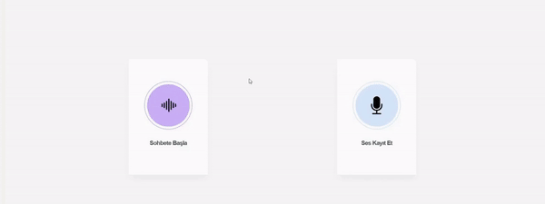
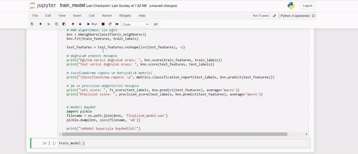
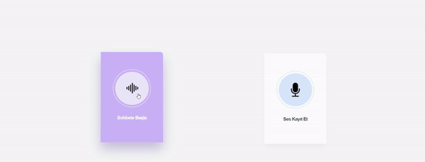

## Install

Open Terminal 

```
1. git clone https://github.com/yusufEk1n/Speech-Recognition.git
```

```
2. python -m venv venv
```

```
3. venv\Scripts\activate
```

```
4. pip install -r requirements.txt
```

```
5. python app.py
```

## How does it work?

- #### Record audio for train



- #### Train model




- #### Start to talking

